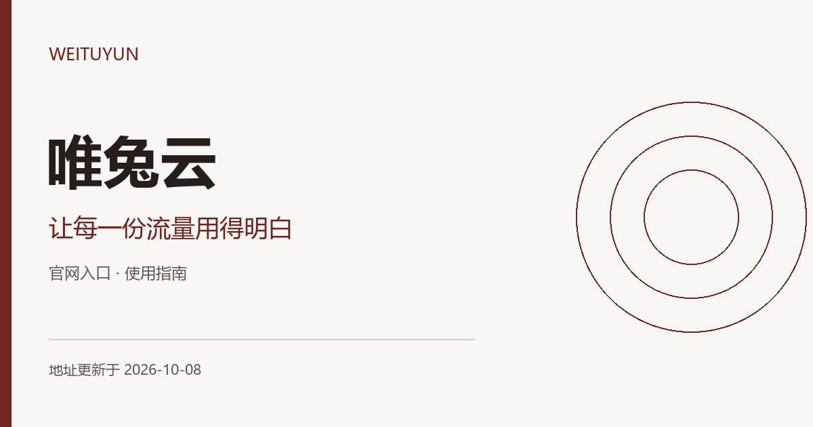

# 唯兔雲機場官網入口｜VPN輕量用量與訂閱 **（更新於2026-10-08）**

[简体中文](README.md) · **繁體中文** · [English](README.en.md) · [日本語](README.ja.md) · [한국어](README.ko.md) · [Русский](README.ru.md)

本專案由唯兔雲官方釋出與維護。唯兔雲機場（WeiTuYun）官方入口與VPN輕量使用指南：按使用頻率比較流量、有效期和接入方式，附備用賬戶檢查步驟。 唯兔雲加速器的輕量使用，從每月實際使用天數與流量期限開始規劃。

**地址更新於 2026-10-08（北京時間）**

[官網入口](#official-addresses) · [使用步驟](#usage-guide) · [術語與接入方式](#connection-terms) · [常見問題](#brand-faq)

## WeiTuYun · 唯兔雲機場官方地址

| 入口 | 訪問地址 |
| --- | --- |
| 入口 1 | [weituyungw.com](https://weituyungw.com/) |
| 入口 2 | [weituyunjsq.com](https://weituyunjsq.com/) |
| 入口 3 | [weituyunjc.com](https://weituyunjc.com/) |
| 入口 4 | [weituyun-vpn.com](https://weituyun-vpn.com/) |

以上鍊接是網站入口，供訪問服務資訊與管理賬戶使用；它們不是個人訂閱連結，也不是代理節點。多個域名可能連線同一賬戶服務，不代表獨立備用線路或速度差異。

## 輕量使用也要分清流量規則

唯兔雲指南從輕量賬戶的維護出發，幫助你核對計費方式、客戶端與流量消耗。經常使用和偶爾備用的需求，可以用不同的核對清單判斷。

### 1. 寫下實際使用頻率

先估計每月使用天數和主要應用，再對照當前方案。一次性總流量與每月額度要分別比較。

### 2. 確認接入文件

在準備客戶端之前，檢視賬戶提供的是登入式接入還是訂閱匯入，避免使用不適用的舊教程。

### 3. 檢查扣量與有效期

記錄一次短時間使用前後的流量變化，並確認重置、到期及追加規則，建立自己的用量基準。

## 唯兔雲：機場和 VPN 加速器的流量，怎樣計算才清楚？

VPN 通常指虛擬專用網路；本指南中的“機場”指訂閱代理服務，“加速器”是更寬泛的軟體或服務稱呼，具體接入能力以賬戶文件為準。

“科學上網”和“魔法”是網路訪問場景中的常見俗稱，不是固定協議、獨立套餐或速度保證。

分別記錄傳輸量、扣除量和餘額，核對當前節點倍率以及上下行計費規則。月度額度與一次性總量需要先統一期限，再比較成本。

## 使用體驗如何檢查

把地區、運營商、時段、客戶端版本和目標應用保持一致，再比較連線結果。持續訪問、下載峰值和應用地區識別是不同指標；失敗或超時也應記錄。本文未釋出本次實測速度或實時節點狀態。

可在自己的裝置上記錄以下資訊，向賬戶支援反饋時隱藏個人憑據：

| 記錄項 | 填寫方式 |
| --- | --- |
| 裝置與網路 | 系統、客戶端版本、運營商及 Wi-Fi／移動資料 |
| 當前配置 | 節點名稱、訂閱更新時間，不記錄金鑰 |
| 具體場景 | 應用名稱、操作步驟與觀察到的結果 |
| 發生時間 | 註明日期、時間及所在時區 |

## 唯兔雲常見問題

### 一年只偶爾使用應該看哪項？

優先比較到期時間、最低支付週期和流量有效期，而不是隻看折算月價。

### 唯兔雲頁面能開啟但軟體不通怎麼辦？

分別檢查賬戶剩餘流量、訂閱更新時間和客戶端錯誤；入口頁面可訪問不能說明節點連線狀態。

### 當前套餐價格與活動在哪裡確認？

進入賬戶檢視當前訂單，核對實付金額、付款週期、流量重置、有效期、裝置限制與售後條件。歷史截圖和舊優惠碼不能代替當前交易條款。

## 使用本倉庫的入口網頁

`index.html` 提供唯兔雲入口導航、完整域名、複製按鈕、操作指南和閱讀確認清單。可在本地開啟，也可將本目錄放在靜態 Web 伺服器上使用；頁面無需構建，不收集賬戶資訊，不自動跳轉。倉庫推送本身不會部署網站。

## 更新與反饋

地址或文件有誤，可在本倉庫提交 Issue，附上域名、發生時間與頁面提示。登入、訂單和付款問題請透過賬戶頁面的支援渠道處理。不要公開密碼、支付資訊或個人訂閱連結。更新日期隨地址清單的實際變更維護，不按訪問或構建自動重新整理。
